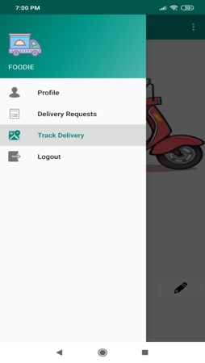
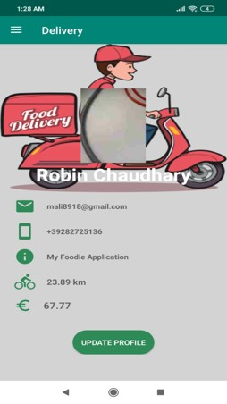
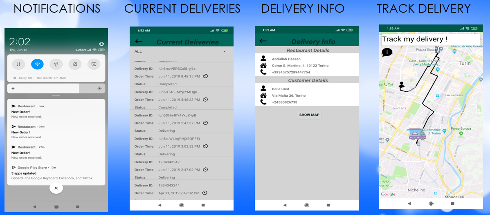

# delivery_notify
This app is one module of a Food Delivery Project. This app recieves the notification from Restaurant Manager app, 
with the details of food items ordered by customer. Also the address of restaurant from where the order has to be picked 
and address of customer where the order need to be dropped. 
Below are the screenshots of menu and profile page of delivery app:

                

The delivery man can use the map to track the path to reach the customer address. 
Google Firebase Console was used to store the data. 
Below are other activity pages of delivery app:

